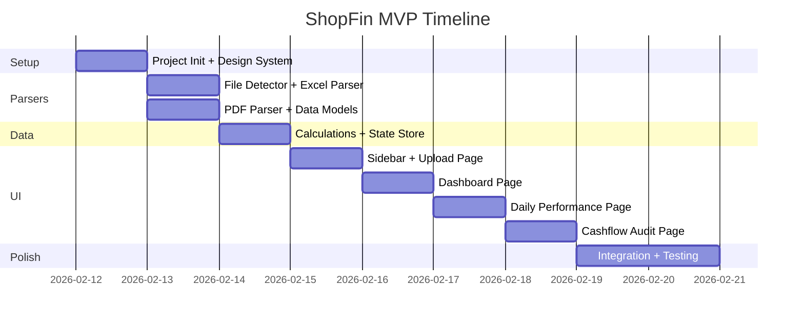

# ShopFin MVP — Kế hoạch Triển khai Giai đoạn 1

## Mục tiêu
Xây dựng ứng dụng web **client-side** cho phép chủ shop Shopee upload file báo cáo (PDF + Excel) và xem dashboard tài chính trực quan. Toàn bộ xử lý trên browser, không cần backend.

---

## Proposed Changes

### Milestone 1: Project Setup

#### [NEW] Project initialization
- Khởi tạo Next.js 14 (App Router) + TypeScript tại `/Users/detaunisex/Documents/DUONGBIRKEN/SHOPFIN`
- Cài thư viện: `xlsx` (SheetJS), `pdfjs-dist`, `recharts`, `lucide-react` (icons)
- Thiết lập Design System: CSS variables, global styles, Inter font

#### [NEW] File structure

```
SHOPFIN/
├── src/
│   ├── app/
│   │   ├── layout.tsx          # Root layout + sidebar
│   │   ├── page.tsx            # Redirect → /upload
│   │   ├── upload/page.tsx     # Trang Upload
│   │   ├── dashboard/page.tsx  # Trang Dashboard
│   │   ├── daily/page.tsx      # Trang Doanh thu ngày
│   │   └── cashflow/page.tsx   # Trang Đối soát
│   ├── components/
│   │   ├── layout/
│   │   │   └── Sidebar.tsx
│   │   ├── upload/
│   │   │   ├── DropZone.tsx
│   │   │   └── FileStatusCard.tsx
│   │   ├── dashboard/
│   │   │   ├── KpiCard.tsx
│   │   │   ├── FeeBreakdownChart.tsx
│   │   │   ├── RevenueCompareChart.tsx
│   │   │   └── MetricCard.tsx
│   │   ├── daily/
│   │   │   ├── DailyTrendChart.tsx
│   │   │   └── DailyTable.tsx
│   │   └── cashflow/
│   │       ├── ComparisonCard.tsx
│   │       ├── PendingOrdersTable.tsx
│   │       └── CashflowChart.tsx
│   ├── lib/
│   │   ├── parsers/
│   │   │   ├── pdf-parser.ts       # Parse PDF thu nhập
│   │   │   ├── order-parser.ts     # Parse Excel đơn hàng
│   │   │   ├── product-parser.ts   # Parse Excel sản phẩm
│   │   │   ├── wallet-parser.ts    # Parse Excel giao dịch ví
│   │   │   └── file-detector.ts    # Auto-detect loại file
│   │   ├── calculations.ts         # Công thức logic (ROAS, tỷ lệ phí...)
│   │   └── formatters.ts           # Format tiền, %, ngày
│   ├── store/
│   │   └── useShopData.ts          # State management (Context/Zustand)
│   ├── types/
│   │   └── index.ts                # TypeScript interfaces
│   └── styles/
│       └── globals.css             # Design system + global styles
├── public/
├── package.json
├── tsconfig.json
└── next.config.ts
```

---

### Milestone 2: File Parsers

#### [NEW] [index.ts](file:///Users/detaunisex/Documents/DUONGBIRKEN/SHOPFIN/src/types/index.ts)
Data models — các interface TypeScript:

```typescript
// Dữ liệu từ PDF Báo cáo Thu nhập
interface IncomeReport {
  grossRevenue: number;        // Tổng doanh số SP
  fixedFee: number;            // Phí cố định
  serviceFee: number;          // Phí dịch vụ
  paymentFee: number;          // Phí thanh toán
  netRevenue: number;          // Doanh thu thực nhận
}

// Dữ liệu từ Excel Đơn hàng
interface OrderData {
  orderId: string;
  status: 'completed' | 'cancelled' | 'pending' | 'returning';
  totalAmount: number;
  orderDate: string;
}

// Dữ liệu từ Excel Sản phẩm
interface ProductData {
  date: string;
  pageViews: number;
  visitors: number;
  confirmedSales: number;
}

// Dữ liệu từ Excel Giao dịch Ví
interface WalletTransaction {
  date: string;
  type: 'income' | 'ads_expense' | 'other';
  amount: number;
  description: string;
}
```

#### [NEW] [pdf-parser.ts](file:///Users/detaunisex/Documents/DUONGBIRKEN/SHOPFIN/src/lib/parsers/pdf-parser.ts)
- Dùng `pdfjs-dist` để extract text từ PDF
- Regex patterns nhận diện các giá trị: doanh thu, phí cố định, phí dịch vụ, phí thanh toán
- Cần phân tích cấu trúc PDF mẫu (`monthly_report_20260101.pdf`) để viết regex chính xác

#### [NEW] [order-parser.ts](file:///Users/detaunisex/Documents/DUONGBIRKEN/SHOPFIN/src/lib/parsers/order-parser.ts)
- Dùng `xlsx` (SheetJS) đọc file `Order.all.*.xlsx`
- Map columns theo header row → extract orderId, status, totalAmount, orderDate

#### [NEW] [product-parser.ts](file:///Users/detaunisex/Documents/DUONGBIRKEN/SHOPFIN/src/lib/parsers/product-parser.ts)
- Đọc file `productoverview*.xlsx`
- Extract: date, pageViews, visitors, confirmedSales

#### [NEW] [file-detector.ts](file:///Users/detaunisex/Documents/DUONGBIRKEN/SHOPFIN/src/lib/parsers/file-detector.ts)
- Auto-detect loại file dựa trên: extension (.pdf/.xlsx) + filename pattern + header columns
- Return enum: `'income_pdf' | 'orders' | 'products' | 'wallet'`

---

### Milestone 3: Data Processing

#### [NEW] [calculations.ts](file:///Users/detaunisex/Documents/DUONGBIRKEN/SHOPFIN/src/lib/calculations.ts)
Công thức logic MVP:

| Metric | Công thức |
|---|---|
| Tổng phí sàn | fixedFee + serviceFee + paymentFee |
| Tỷ lệ phí sàn | (totalFees / grossRevenue) × 100 |
| ROAS | walletIncome / adsExpense |
| Tỷ lệ hủy đơn | (cancelledOrders / totalOrders) × 100 |
| Chênh lệch dòng tiền | walletIncome − netRevenue |

#### [NEW] [useShopData.ts](file:///Users/detaunisex/Documents/DUONGBIRKEN/SHOPFIN/src/store/useShopData.ts)
State management lưu toàn bộ parsed data + calculated metrics:
- `uploadedFiles` — trạng thái upload từng loại file
- `incomeReport` — data từ PDF
- `orders` — mảng đơn hàng
- `dailyProducts` — data sản phẩm theo ngày
- `walletTransactions` — giao dịch ví
- `calculatedMetrics` — KPI đã tính toán

---

### Milestone 4: UI Pages

#### [NEW] [Sidebar.tsx](file:///Users/detaunisex/Documents/DUONGBIRKEN/SHOPFIN/src/components/layout/Sidebar.tsx)
- Logo ShopFin + 4 nav items + active state
- Responsive: collapse thành icon-only ở viewport nhỏ

#### [NEW] Upload Page (`/upload`)
- `DropZone.tsx` — Drag & drop + file picker, hỗ trợ multi-file
- `FileStatusCard.tsx` × 4 — Hiển thị trạng thái từng loại file
- Auto-detect file type khi drop → parse → update store
- Nút "Phân tích" → navigate sang Dashboard

#### [NEW] Dashboard Page (`/dashboard`)
- `KpiCard.tsx` × 4 — Doanh số, Doanh thu thực, Phí sàn, Chi phí Ads
- `FeeBreakdownChart.tsx` — Donut chart (Recharts PieChart)
- `RevenueCompareChart.tsx` — Bar chart so sánh
- `MetricCard.tsx` × 3 — Tỷ lệ phí, ROAS, Hủy đơn
- Count-up animation cho KPI numbers

#### [NEW] Daily Performance Page (`/daily`)
- `DailyTrendChart.tsx` — Area chart 3 lines (Recharts AreaChart)
- `DailyTable.tsx` — Data table + sort + export CSV
- Date range selector

#### [NEW] Cashflow Audit Page (`/cashflow`)
- `ComparisonCard.tsx` × 2 — Doanh thu báo cáo vs Tiền thực về
- Chênh lệch badge (tự động màu theo ngưỡng)
- `PendingOrdersTable.tsx` — Danh sách đơn treo
- `CashflowChart.tsx` — Bar chart dòng tiền ngày

---

### Milestone 5: Integration & Polish

#### [MODIFY] Tất cả pages
- Kết nối store → UI (đảm bảo data flow liền mạch)
- Empty states khi chưa upload file
- Error handling: file sai format, file rỗng, parse lỗi
- Loading states khi đang parse
- Responsive layout cho tablet/mobile
- Animations: count-up, fade-in, chart transitions

---

## Verification Plan

### Automated Tests (Browser)
1. **Upload flow**: Mở app → navigate `/upload` → verify drop zone hiển thị → verify 4 file status cards ở trạng thái "chờ upload"
2. **Dashboard rendering**: Navigate `/dashboard` → verify 4 KPI cards, 2 charts, 3 metric cards hiển thị đúng
3. **Daily table**: Navigate `/daily` → verify bảng có đủ columns: Ngày, GMV, Doanh số xác nhận, Thu nhập ví, Lượt xem, Khách
4. **Cashflow page**: Navigate `/cashflow` → verify 2 comparison cards + đơn treo table hiển thị

### Manual Verification (Sau khi hoàn thành)
1. Upload 4 file mẫu từ `Datamauthang1/` → Kiểm tra parser đọc đúng giá trị
2. So sánh KPI trên Dashboard với giá trị trong PRD (₫257,128,170 doanh số, ₫171,011,604 thực nhận...)
3. Kiểm tra responsive trên Chrome DevTools ở 3 breakpoints
4. Test edge case: upload file sai format, upload lại file mới

---

## Thứ tự triển khai đề xuất



| Milestone | Ước tính | Tích lũy |
|---|---|---|
| 1. Project Setup | ~1 session | 1 session |
| 2. File Parsers | ~2 sessions | 3 sessions |
| 3. Data Processing | ~1 session | 4 sessions |
| 4. UI Pages (4 trang) | ~4 sessions | 8 sessions |
| 5. Integration & Polish | ~2 sessions | **10 sessions** |

> [!IMPORTANT]
> Mỗi milestone FIN sẽ hoàn thành rồi demo cho bạn kiểm tra trước khi chuyển milestone tiếp theo. FIN sẽ **không tự động CODE** mà chờ bạn xác nhận **"CODE đi"** cho từng bước.
