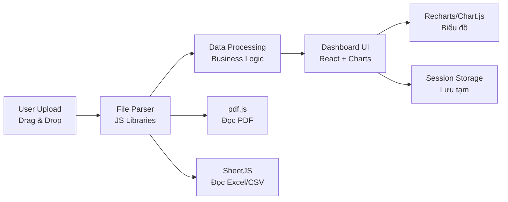

# 📊 Báo cáo Phân tích PRD ShopFin MVP V1.0

## 1. Tổng quan đánh giá

| Tiêu chí | Đánh giá |
|---|---|
| **Tầm nhìn sản phẩm** | ⭐⭐⭐⭐ Rõ ràng, giải quyết pain point thực tế |
| **Phạm vi MVP** | ⭐⭐⭐⭐ Gọn gàng, tập trung đúng giá trị cốt lõi |
| **Tính khả thi kỹ thuật** | ⭐⭐⭐ Có điểm cần cân nhắc lại |
| **Độ chi tiết PRD** | ⭐⭐⭐ Cần bổ sung thêm một số phần |

**Nhận xét chung:** PRD có hướng đi rất thực tế — tập trung vào **file-based automation** cho giai đoạn MVP là quyết định đúng. Giá trị cốt lõi rõ ràng: giúp chủ shop nhìn nhanh lợi nhuận thực tế và đối soát dòng tiền chỉ bằng cách upload file.

---

## 2. Điểm mạnh ✅

### 2.1. Giải quyết đúng Pain Point
- Chủ shop Shopee phải tự tổng hợp nhiều file báo cáo → mất thời gian, dễ sai sót
- MVP giúp tự động hóa quy trình này mà **không cần API** → triển khai nhanh

### 2.2. Phạm vi MVP hợp lý
- 4 loại file đầu vào rõ ràng (PDF thu nhập, CSV đơn hàng, CSV sản phẩm, CSV giao dịch ví)
- Tập trung vào 4 chức năng cốt lõi: Dashboard, Daily Performance, Cashflow Audit, Công thức tính toán
- Không over-engineer với database hay sản phẩm mapping

### 2.3. Công thức logic có giá trị
- Tỷ lệ phí sàn/Doanh thu (~28%)
- ROAS thực tế
- Tỷ lệ hủy đơn
→ Đây là những con số mà chủ shop **rất cần** nhưng Shopee không hiển thị trực quan

### 2.4. Privacy-first approach
- Sử dụng Session Storage, không lưu dữ liệu khi đóng trình duyệt → Phù hợp cho MVP khi chưa có hệ thống auth

---

## 3. Điểm cần cải thiện ⚠️

### 3.1. Kỹ thuật: Rust/WASM có cần thiết cho MVP?

> PRD ghi: *"Parser viết bằng Rust/WASM để đọc PDF và CSV ngay tại trình duyệt"*

| So sánh | Rust/WASM | JavaScript thuần |
|---|---|---|
| **Thời gian phát triển** | Cao (cần biết Rust) | Thấp |
| **Hiệu năng đọc PDF** | Nhanh hơn ~2-5x | Đủ dùng cho file < 5MB |
| **Thư viện hỗ trợ** | Hạn chế | Phong phú (`pdf.js`, `Papa Parse`, `SheetJS`) |
| **MVP phù hợp?** | ❌ Over-engineering | ✅ Phù hợp |

> [!IMPORTANT]
> **Khuyến nghị:** Dùng JavaScript thuần với `pdf.js` (đọc PDF) + `Papa Parse` hoặc `SheetJS` (đọc CSV/Excel) cho MVP. Chuyển sang WASM khi cần scale hiệu năng ở giai đoạn sau.

### 3.2. Dữ liệu đầu vào: CSV hay Excel?
- PRD ghi nhận file input là **CSV**, nhưng file mẫu thực tế trong `Datamauthang1/` lại là **`.xlsx` (Excel)**
- Shopee thực tế xuất file dạng **Excel (.xlsx)**, không phải CSV

> [!WARNING]
> Cần thống nhất: Parser phải hỗ trợ đọc **Excel (.xlsx)** thay vì CSV, hoặc hỗ trợ cả hai.

### 3.3. Tính năng Auto-scan Folder
- Tính năng *"chọn thư mục Downloads và tự phát hiện file mới"* **không khả thi trên nền tảng Web** do giới hạn bảo mật trình duyệt
- Web browser không cho phép ứng dụng web tự động theo dõi (watch) một thư mục trên máy tính người dùng

> [!CAUTION]
> **Khuyến nghị:** Loại bỏ tính năng này khỏi MVP. Thay thế bằng **Drag & Drop upload** đơn giản. Nếu muốn auto-scan, cần chuyển sang nền tảng Desktop (Electron/Tauri).

### 3.4. Thiếu phần quan trọng trong PRD

| Nội dung thiếu | Ảnh hưởng |
|---|---|
| **UI/UX wireframe** hoặc mô tả giao diện | Không biết dashboard trông như thế nào |
| **Trạng thái đơn hàng chi tiết** | Shopee có nhiều trạng thái (Chờ xác nhận, Đang giao, Trả hàng...), PRD chỉ nhắc Hoàn thành/Đã hủy |
| **Xử lý lỗi** | Khi file upload sai format hoặc thiếu dữ liệu thì xử lý thế nào? |
| **Multi-period** | Người dùng upload nhiều tháng thì dữ liệu có gộp được không? |
| **Hỗ trợ TikTok Shop** | Tiêu đề đề cập TikTok nhưng PRD chỉ mô tả Shopee |

---

## 4. Phân tích dữ liệu mẫu (Datamauthang1)

FIN đã phát hiện các file dữ liệu mẫu tháng 1/2026:

| File | Loại | Vai trò trong PRD |
|---|---|---|
| `Order.all.20260101_20260131.xlsx` (427KB) | Excel | Báo cáo Đơn hàng |
| `productoverview20260101-20260131.xlsx` (11KB) | Excel | Báo cáo Sản phẩm |
| `monthly_report_20260101.pdf` (55KB) | PDF | Báo cáo Thu nhập |
| `1118487.pdf`, `1353522.pdf`, `957060.pdf` | PDF | Có thể là báo cáo giao dịch ví hoặc chi tiết đơn |

→ Đây là lợi thế lớn: có dữ liệu thực để test parser và thiết kế UI.

---

## 5. Đề xuất Stack kỹ thuật cho MVP

| Layer | Đề xuất | Lý do |
|---|---|---|
| **Framework** | Next.js hoặc Vite + React | Nhẹ, nhanh, phù hợp SPA |
| **PDF Parser** | `pdf.js` (Mozilla) | Miễn phí, chạy client-side |
| **Excel Parser** | `SheetJS` (xlsx) | Hỗ trợ .xlsx/.csv, rất phổ biến |
| **Charts** | `Recharts` hoặc `Chart.js` | Dễ tùy biến, responsive |
| **Storage** | Session Storage / In-memory state | Đúng yêu cầu PRD |
| **Styling** | Vanilla CSS hoặc Tailwind | Tùy sở thích |

---

## 6. Đề xuất Roadmap MVP

| Phase | Nội dung | Ưu tiên |
|---|---|---|
| **Phase 1** | Upload & Parse file (PDF + Excel) | 🔴 Cao |
| **Phase 2** | Dashboard tài chính (KPI cards + biểu đồ) | 🔴 Cao |
| **Phase 3** | Bảng doanh thu hằng ngày (Daily Performance) | 🟡 Trung bình |
| **Phase 4** | Module đối soát dòng tiền (Cashflow Audit) | 🟡 Trung bình |
| **Phase 5** | Polish UI/UX + xử lý edge cases | 🟢 Thấp |

---

## 7. Kết luận

ShopFin MVP có tiềm năng **rất tốt** — giải quyết đúng vấn đề thực tế của chủ shop TMĐT. Tuy nhiên, cần:

1. ✏️ **Điều chỉnh** stack kỹ thuật (bỏ Rust/WASM, dùng JS thuần)
2. ✏️ **Loại bỏ** tính năng Auto-scan Folder (không khả thi trên web)
3. ✏️ **Bổ sung** hỗ trợ đọc file Excel (.xlsx) thay vì chỉ CSV
4. ✏️ **Bổ sung** mô tả UI/UX, xử lý lỗi, và kế hoạch hỗ trợ TikTok
5. ✏️ **Cân nhắc** cho phép lưu dữ liệu qua `localStorage` hoặc `IndexedDB` thay vì chỉ Session Storage — để người dùng không mất dữ liệu khi refresh trang
