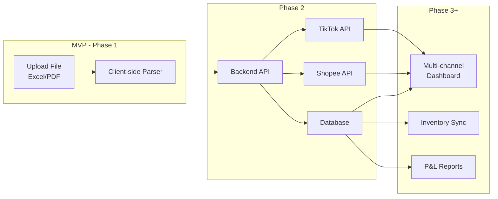
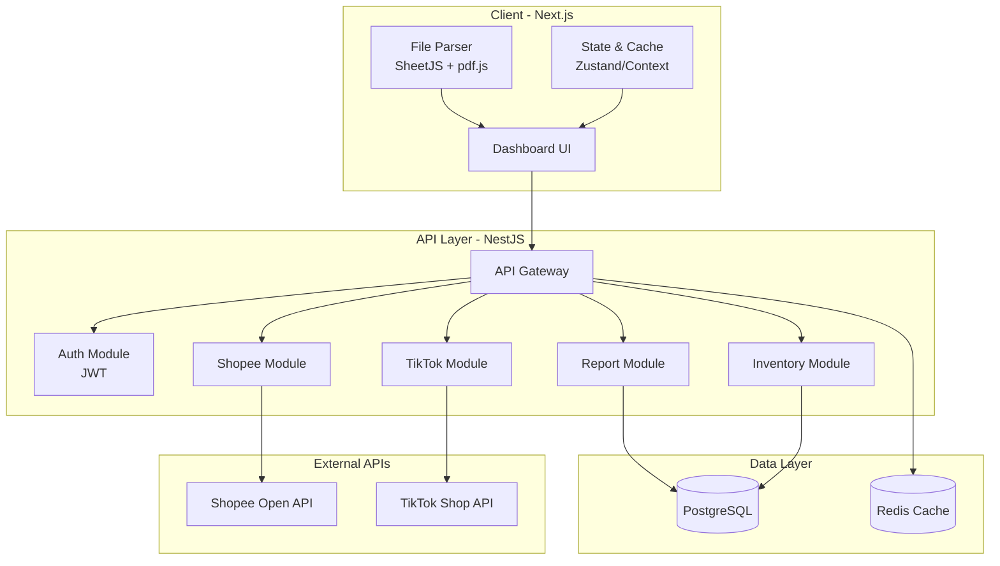

# 🏗️ ShopFin — Đề xuất Stack Kỹ thuật (Tầm nhìn dài hạn)

## Tầm nhìn sản phẩm



| Giai đoạn | Mục tiêu |
|---|---|
| **MVP** | Upload file → Dashboard báo cáo (client-side) |
| **Phase 2** | Backend + Database + Auth |
| **Phase 3** | Kết nối API Shopee/TikTok trực tiếp |
| **Phase 4** | Quản lý tồn kho, P&L đa kênh |

---

## Đề xuất Stack kỹ thuật

### Frontend

| Công nghệ | Lý do chọn |
|---|---|
| **Next.js 14+ (App Router)** | SSR/SSG hỗ trợ SEO, API Routes tích hợp sẵn, dễ scale lên fullstack. Phù hợp cho cả MVP (static) lẫn phase sau (server-side) |
| **TypeScript** | Type-safe — Khi mở rộng đa kênh, data model phức tạp sẽ cần type checking nghiêm ngặt |
| **Recharts** | Thư viện biểu đồ React-native, responsive, hỗ trợ nhiều loại chart cho báo cáo tài chính |
| **SheetJS (xlsx)** | Đọc/ghi file Excel client-side — core parser cho MVP |
| **pdf.js** (Mozilla) | Đọc PDF báo cáo thu nhập Shopee ngay trên browser |

### Backend (Từ Phase 2)

| Công nghệ | Lý do chọn |
|---|---|
| **Node.js + NestJS** | Framework enterprise-grade, cấu trúc module rõ ràng. Phù hợp khi tích hợp nhiều API sàn TMĐT |
| **TypeScript** | Dùng chung ngôn ngữ FE/BE → một team có thể handle cả hai |
| **Prisma ORM** | Type-safe database access, migration dễ quản lý, hỗ trợ nhiều DB |

### Database (Từ Phase 2)

| Công nghệ | Lý do chọn |
|---|---|
| **PostgreSQL** | Quan hệ phức tạp (đơn hàng ↔ sản phẩm ↔ kênh bán ↔ tài chính), JSON support cho dữ liệu linh hoạt từ các sàn khác nhau |
| **Redis** | Cache cho dashboard metrics, session management, rate limiting khi gọi API sàn |

### Infra & DevOps (Từ Phase 2-3)

| Công nghệ | Lý do chọn |
|---|---|
| **Docker** | Đóng gói môi trường, dễ deploy |
| **Vercel** (MVP) / **VPS** (Phase 2+) | MVP deploy miễn phí trên Vercel, scale lên VPS khi cần backend |

---

## Kiến trúc tổng thể (Scalable)



---

## Chiến lược phát triển theo giai đoạn

### 🟢 MVP (Tuần 1-3): Client-side Only

```
Next.js (Static Export) + SheetJS + pdf.js + Recharts
Deploy: Vercel (miễn phí)
Storage: localStorage / IndexedDB
```

- Upload file Excel/PDF → Parse → Dashboard
- Không cần backend, không cần database
- **Toàn bộ xử lý trên browser**

### 🟡 Phase 2 (Tháng 2-3): Thêm Backend

```
+ NestJS backend
+ PostgreSQL + Prisma
+ Auth (JWT)
+ Docker
```

- Lưu trữ dữ liệu lịch sử
- Multi-user, đăng nhập/đăng ký
- So sánh dữ liệu giữa các tháng

### 🔴 Phase 3 (Tháng 4-6): API Integration

```
+ Shopee Open Platform API
+ TikTok Shop API
+ Redis caching
+ Background jobs (Bull Queue)
```

- Auto-sync đơn hàng, doanh thu từ sàn
- Không cần upload file nữa (tùy chọn)
- Real-time dashboard

### 🔵 Phase 4 (Tháng 6+): Multi-channel Platform

```
+ Inventory management
+ P&L reports đa kênh
+ Thêm sàn mới (Lazada, Sendo...)
+ Mobile app (React Native)
```

---

## So sánh với Stack ban đầu trong PRD

| Yếu tố | PRD gốc (Rust/WASM) | Đề xuất mới |
|---|---|---|
| **Ngôn ngữ** | Rust + JS | TypeScript toàn bộ |
| **Parser** | Rust/WASM | SheetJS + pdf.js (JS) |
| **Backend** | Không có | NestJS (Phase 2) |
| **Database** | Session Storage | PostgreSQL (Phase 2) |
| **Khả năng mở rộng** | Khó (Rust skill hiếm) | Dễ (JS ecosystem lớn) |
| **Time-to-MVP** | 4-6 tuần | 2-3 tuần |
| **Chi phí đội ngũ** | Cần dev Rust | Chỉ cần dev JS/TS |

---

## Tổng kết

> [!TIP]
> **Nguyên tắc cốt lõi:** Dùng **TypeScript xuyên suốt** (FE + BE) để giảm context switch, tăng tốc phát triển, và dễ tuyển dụng. MVP chạy hoàn toàn client-side, backend chỉ thêm khi thực sự cần — tránh over-engineering sớm.

| Ưu điểm stack đề xuất |
|---|
| ✅ **Một ngôn ngữ** (TypeScript) cho toàn bộ hệ thống |
| ✅ **MVP nhanh** — 2-3 tuần có sản phẩm dùng được |
| ✅ **Scale tự nhiên** — từ static site → fullstack → multi-service |
| ✅ **Ecosystem lớn** — thư viện phong phú, community hỗ trợ tốt |
| ✅ **Chi phí thấp** — MVP deploy miễn phí trên Vercel |
